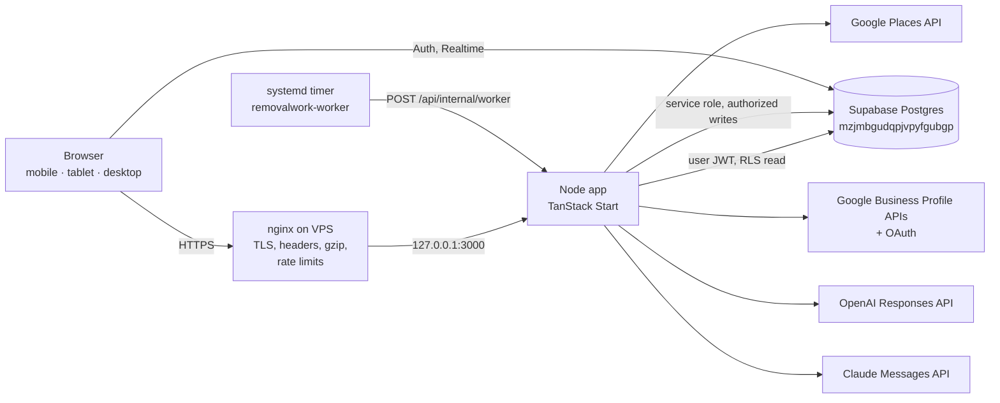
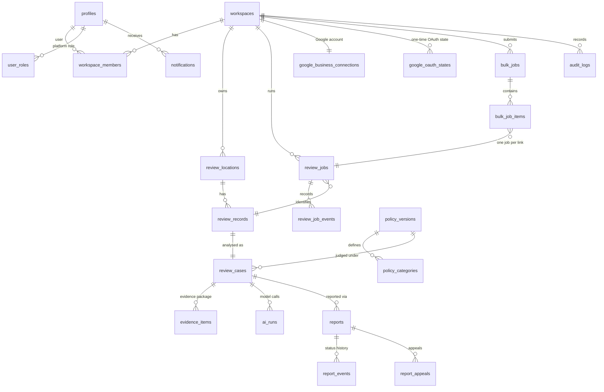
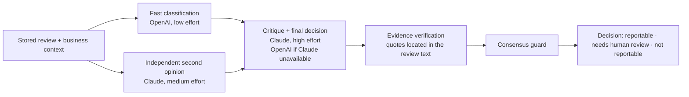
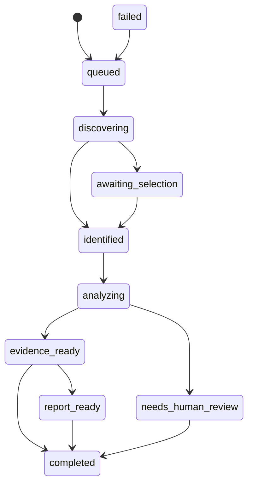
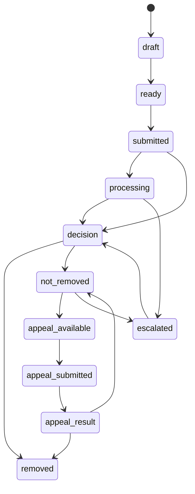

# Removal Work — system architecture

This document describes the system as implemented on branch `vps-production`. Where something is
not live yet, it says so and names the real blocker.

## 0. Current status and external blockers

| Area | State |
|---|---|
| Production hosting | `removalwork.online` → VPS 187.53.134.164 → nginx → Node app on 127.0.0.1:3000 (`review-guardian-ai.service`). The retired OrbitRep app is stopped and disabled; its backup is kept. |
| Database schema | `supabase/migrations/20260913200000_removal_work_schema.sql` is written and tested (see §19) but **not yet applied to the production Supabase project**: no credential on the VPS can run DDL. Until it is applied, signed-in pages fail with an explicit error. |
| Google Places | Live. Identifies businesses; Google withholds review text for this Cloud project. |
| Google Business Profile API | OAuth client, redirect URI, secret and a real connected account verified. **Google reports a 0 requests/minute quota** (`DefaultRequestsPerMinutePerProject = 0`): Basic API Access for Cloud project 201313343292 is not approved, so owner reviews cannot be read until Google approves it. |
| OpenAI / Claude | Integrated directly. **No `OPENAI_API_KEY` or `ANTHROPIC_API_KEY` is configured on the VPS yet**, so analysis reports "The AI service isn't configured yet." |

Nothing in the product substitutes sample data for any of these.

## 1. System architecture



- **One application**: UI, server functions and HTTP routes are one TanStack Start app built with the
  Nitro `node-server` preset. Lovable is a development reference only; no Lovable host, proxy or
  gateway is in the request path (the release script refuses a build that references one).
- **Supabase is the source of truth** for identity, workspaces, jobs, reviews, analysis, evidence,
  reports and history.

## 2. User flow

```mermaid
flowchart TD
  L[Sign in /auth] --> W[Workspace resolved on the server<br/>ensure_my_workspace]
  W --> R[/app/reviews]
  R --> N[Add review /app/reviews/new]
  N --> J[review_job created<br/>idempotent per link, 5-min window]
  J --> D[Discovering: parse link, Places, Business Profile]
  D -->|exact review verified| I[Identified]
  D -->|several real reviews| S[Awaiting selection<br/>user picks — never guessed]
  S --> I
  D -->|no review text / error| F[Failed with the real reason]
  I --> A[Analyzing: OpenAI + Claude]
  A --> E[Evidence ready: quotes verified in code]
  E -->|reportable| RR[Report ready → report draft/ready]
  E -->|needs judgement| H[Needs human review]
  E -->|within the rules| C[Completed, nothing to report]
  RR --> CD[/app/reviews/:caseId]
  H --> CD
  CD --> G[User files the report in Google Maps]
  G --> ST[Status recorded: submitted → processing → decision → removed / not removed → appeal]
```

Signed-out visitors can still run a public scan on the landing page (Google public data only,
rate-limited per IP); signed-in scans always run as workspace jobs.

## 3. Admin flow

`/admin` is separate from the client workspace. Every admin server function re-checks
`is_superadmin()` in the database.

- **System** — integration health (Supabase, Places, Business Profile quota state, OpenAI, Claude,
  worker), configuration presence (booleans, never values), build/commit/uptime, pipeline load,
  database aggregates from `admin_system_overview()`.
- **Jobs** — all review jobs across workspaces, filter by status, retry failed jobs.
- **Users & workspaces** — accounts, platform roles, memberships, workspace sizes.
- **AI runs** — every model call with stage, model, prompt/policy version, latency, outcome.
- **Audit log** — append-only actions.

## 4. ERD



Conceptual entity → table: user → `auth.users` + `profiles`; workspace → `workspaces`;
business/location → `review_locations`; review + review source → `review_records` (`source`,
`identity_*`); review analysis + policy match → `review_cases` (+ `policy_versions`,
`policy_categories`); evidence → `evidence_items`; case → `review_cases`; report → `reports`;
report events → `report_events`; appeal → `report_appeals`; URL batches → `bulk_jobs` /
`bulk_job_items`; processing jobs → `review_jobs` / `review_job_events`; oauth/platform connections
→ `google_business_connections` / `google_oauth_states`; notifications → `notifications`; audit →
`audit_logs`.

## 5. Database rules and relationships

- UUID primary keys, `created_at`/`updated_at` timestamps, foreign keys with explicit `ON DELETE`.
- Uniques that make work idempotent: `review_jobs (workspace_id, idempotency_key)`,
  `review_records (workspace_id, platform, external_id)`, `review_cases (workspace_id, review_record_id)`,
  `review_locations (workspace_id, platform, place_id)`, `reports (case_id, version)`,
  `bulk_job_items (bulk_job_id, canonical_url)`, `google_business_connections (workspace_id)`.
- Indexes on every workspace listing path (`workspace_id, created_at DESC`), status filters, the worker
  claim path (`status, next_attempt_at, lease_expires_at`) and AI reuse (`workspace_id, input_hash, prompt_version, policy_version`).
- Integrity enforced in the database, not just the app:
  - job and report transitions are validated by triggers and every change is written to
    `review_job_events` / `report_events` with the acting user;
  - `reports.status = 'removed'` requires `decided_at` and an `outcome_source` that is a Google decision;
  - supporting evidence must be `verified` with real excerpt offsets;
  - soft deletion: `workspaces.deleted_at` revokes access; `review_cases.dismissed_at` hides a case.
- **Legacy tables** from the retired OrbitRep app (`businesses`, `business_members`, `reviews`,
  `removal_cases`, `case_events`, `scan_jobs`, `url_batches`, …) are untouched. Their workspaces and
  memberships are copied 1:1 into `workspaces` / `workspace_members` with the same ids. Shared
  identity tables (`profiles`, `user_roles`, `notifications`) are extended, not duplicated.

## 6. API map

All server functions are POST, CSRF-protected by TanStack Start's middleware, validated with zod, and
authorized on the server.

| Module | Functions | Authorization |
|---|---|---|
| `review.functions` | `scanReviewUrl`, `analyzeReviewForPolicy` | public; 20 scans / 10 min and 5 analyses / hour per IP |
| `review-jobs.functions` | `startReviewJob`, `getReviewJob`, `listRecentReviewJobs`, `selectReviewCandidate`, `retryReviewJob`, `cancelReviewJob` | session → workspace → role ≥ member for writes; 30 jobs / 10 min per user |
| `cases.functions` | `listCases`, `listLocations`, `getCaseDetail`, `createReportForCase`, `transitionReport`, `setCaseDismissed`, `getWorkspaceSummary` | session → workspace; writes need member |
| `bulk.functions` | `createBulkJob`, `getBulkJob`, `getLatestBulkJob`, `cancelBulkJob`, `retryFailedBulkItems` | member; 5 bulk scans / hour per user |
| `google-business.functions` | `getGoogleBusinessConnection`, `startGoogleBusinessConnection`, `disconnectGoogleBusiness` | read: member; connect/disconnect: admin |
| `admin.functions` | `getAdminOverview`, `listAdminJobs`, `retryAdminJob`, `listAdminWorkspaces`, `listAdminUsers`, `listAdminAuditLogs`, `listAdminAiRuns` | `is_superadmin()` |

| HTTP route | Purpose | Protection |
|---|---|---|
| `GET /api/public/health` | liveness + database readiness | public, no configuration details |
| `GET /api/public/version` | build identity | public, non-secret |
| `GET /api/public/google/callback` | Business Profile OAuth callback | one-time hashed state, PKCE, 10-min expiry |
| `POST /api/internal/worker` | worker pass | worker secret **and** nginx `allow 127.0.0.1; deny all` |

Mapping from the conceptual route groups: `/api/auth/*` is Supabase Auth; `/api/workspace/*`,
`/api/reviews/*`, `/api/reports/*`, `/api/google/*`, `/api/ai/*` and `/api/admin/*` are the server
function modules above; `/api/internal/*` is the worker route.

## 7. Routing map

| Path | Page |
|---|---|
| `/` | landing + public scan |
| `/auth` (`/login` redirects) | sign in / sign up |
| `/app` → `/app/reviews` | reviews list with in-progress scans |
| `/app/reviews/new` | Add review: paste → scan → live progress → pick review if needed |
| `/app/reviews/:caseId` | review, analysis, evidence, AI verification, report workflow, status history |
| `/app/reports` | ready to report · with Google · outcomes |
| `/app/locations` | businesses scanned |
| `/app/platforms` | Google Business Profile connection, other platforms' real availability |
| `/app/bulk` | bulk scan |
| `/app/settings` | account and workspace |
| `/admin`, `/admin/jobs`, `/admin/users`, `/admin/ai`, `/admin/audit` | super admin |

Old paths `/dashboard`, `/reports`, `/locations`, `/bulk` redirect to their `/app` equivalents.

## 8. AI pipeline



- Both first passes run in parallel; strict JSON schemas on both providers; Claude uses structured
  outputs with server-side refusal fallback.
- Deterministic guards (`applyDecisionGuards`): evidence is kept only if it is found verbatim in the
  review (offsets stored); a reportable verdict with no verifiable evidence becomes
  `needs_human_review`; if both independent opinions found no violation the final model cannot
  report it; disagreement caps `strong_candidate` to `possible_candidate`.
- Every stage is written to `ai_runs` (provider, model, `prompt_version`, `policy_version`,
  `input_hash`, output, confidence, duration, status, error code). An identical input under the same
  prompt/policy version reuses the stored decision instead of calling the models again.
- Policy knowledge is versioned in `policy_versions` / `policy_categories`; `last_verified_at` stays
  empty until an administrator confirms the wording against the official source.

## 9. Google integration flow

1. **Parse** the pasted link without network access: place id, name, coordinates, Maps CID (from the
   `0x…:0x…` feature id) and review id (`!1sCh…`). Only Google hosts are accepted.
2. **Expand short links** one redirect hop at a time, refusing any hop outside Google (SSRF guard).
3. **Identify the business** with Places: explicit place id, or nearby search accepting only the place
   whose Maps URL carries the identical CID, or text search (verified by CID when the link has one;
   a review link is never tied to an unverified business).
4. **Business Profile** (when the workspace has connected Google): list the account's locations,
   match by place id or CID, fetch the exact review with `reviews.get`, otherwise `reviews.list`.
5. **Exact review verification**: a review is "verified" only when Google returns the same review id
   or exact review URL. Otherwise the user picks from Google's real reviews.
6. Every Business Profile failure is described precisely (quota 0, service disabled, 401 reconnect,
   403 not the owner, rate limit). A 0-quota response is cached for 10 minutes so scans stay fast.

OAuth: `business.manage` scope, PKCE, hashed one-time state bound to workspace and user, encrypted
access and refresh tokens (AES-GCM, key only on the server), automatic refresh, revocation on
disconnect, callback `https://removalwork.online/api/public/google/callback`.

## 10. Authentication and authorization

`Supabase Auth session → server verifies the JWT (getClaims) → ensure_my_workspace() → workspace
membership + role → per-action role check`. Roles: `owner > admin > member > viewer`. The platform
super admin is a separate `user_roles` row checked by `is_superadmin()`. No role shown in the UI is
trusted by the server.

## 11. Security model

- **Read-only clients**: signed-in users can only `SELECT` workspace data through RLS
  (`is_workspace_member` or `is_superadmin`). All writes go through server functions that authorize
  first and write with the service role, so clients cannot forge evidence, AI output, job history or
  report outcomes. OAuth token tables are not readable by clients at all.
- **Isolation tested**: non-members see nothing, cannot write, and cannot act on another workspace's ids (IDOR).
- **Legacy privacy fix**: the retired app's "any signed-in user can read every profile and role"
  policies are replaced.
- **Edge**: HTTPS only (HSTS), `X-Content-Type-Options`, `X-Frame-Options: DENY`,
  `Referrer-Policy`, `Permissions-Policy`, CSP `frame-ancestors 'none'; object-src 'none'; base-uri 'self'`,
  hidden nginx version, 1 MB request limit, per-IP rate limits for server functions and public API,
  internal routes limited to localhost, SSH protected by fail2ban, firewall allows 22/80/443 only.
- **Secrets**: only in `/etc/review-guardian-ai.env` (mode 600, root). Logs are structured and carry
  identifiers and timings only. The worker secret is passed to curl on stdin.

## 12. Queue and worker flow

- Work runs in the app process with bounded concurrency (`REVIEW_PIPELINE_CONCURRENCY`, default 3).
- A job is claimed atomically (lease + attempt counter). `claim_review_jobs()` (service role only) uses
  `FOR UPDATE SKIP LOCKED` and never hands out a leased job twice.
- `removalwork-worker.timer` calls the worker every minute: re-queues retryable failures whose backoff
  has passed, resumes jobs whose lease expired (crash recovery), and cancels abandoned review choices
  after 7 days.
- Bulk scans create one independent job per link; one failure never stops the batch; cancel and
  retry-failed are supported.

## 13. State machines



Any unfinished job may move to `failed` or `cancelled`.



Google offers no API to submit review reports, so `submitted` is recorded after the user files the
report in Google Maps (with Google's reference when one is shown). `removed` requires Google's
decision to be recorded.

## 14. Deployment

- `deploy/systemd/review-guardian-ai.service` — the app (`node .output/server/index.mjs`).
- `deploy/systemd/removalwork-worker.{service,timer}` — the worker pass.
- `deploy/release.sh` — builds in a separate checkout, runs unit tests, typecheck and bundle checks
  (no Lovable gateways, correct Supabase project), swaps `.output`, restarts, verifies the new commit
  answers, and restores the previous build if it does not.
- nginx site `removalwork-online` + `conf.d/removalwork-hardening.conf`; Let's Encrypt certificate
  renewed by certbot.

## 15. Responsive design

One application, three layouts from the same components (`src/app-shell.css`):

- **Mobile (< 768 px)**: sticky top bar with *Add review*, bottom navigation with a central Add button,
  single-column cards, 44 px+ touch targets, one-tap paste, tables render as stacked cards.
- **Tablet (768–1023 px)**: icon rail with accessible labels and tooltips.
- **Desktop (≥ 1024 px)**: full sidebar; review detail uses two columns (review + analysis | sticky
  report panel + status history); dense admin tables. Large screens widen to 1440 px.

Every data screen has loading, empty, error-with-retry and permission-denied states; forms announce
errors with `role="alert"`; a skip link and visible focus rings support keyboard use.

## 16. Error and retry flow

| Code | Meaning | Retried |
|---|---|---|
| `rate_limited` | provider rate limit | yes, exponential backoff (30 s → 15 min), up to `max_attempts` |
| `provider_unavailable` | Google unreachable / 5xx | yes |
| `ai_unavailable` | AI unreachable / 429 / 5xx / empty stream | yes |
| `ai_invalid_output` | model output failed schema validation | no |
| `ai_configuration` | missing or rejected AI credentials / model | no |
| `ai_refused` | Claude declined | no |
| `review_text_unavailable` | Google shares no review text | no |
| `business_not_found`, `provider_forbidden`, `not_configured` | as named | no |

Non-retryable failures notify the job's creator and show the real reason in the UI.

## 17. Monitoring and logging

- Structured JSON logs to journald: job transitions, discovery timings, analysis outcome, worker ticks,
  failures (`journalctl -u review-guardian-ai`).
- `/api/public/health` for uptime checks; `/admin` for integration health, latency, stuck/failed jobs,
  AI p50/p95 latency, median scan time.
- `ai_runs`, `review_job_events`, `report_events` and `audit_logs` provide durable history.

## 18. Backup and recovery

- Nightly configuration backup (`removalwork-config-backup.timer`) of the env file, systemd units,
  nginx and certbot renewal config to `/root/backups/config` (14 days).
- Retired app archive `/root/backups/orbitrep-pre-rga-20260913-153552.tar.gz`; rollback script
  `/root/rollback-to-orbitrep.sh`.
- Application rollback: `deploy/release.sh` keeps `.output.previous` and restores it automatically.
- Database: the migration is additive and idempotent; `supabase/rollback/…down.sql` removes only what
  it created (tested). Database backups are Supabase-managed; no database credential exists on the VPS
  for an independent dump — take a Supabase backup before applying the migration.

## 19. Testing

| Layer | Tooling | What it proves |
|---|---|---|
| Unit | `npx vitest run` | evidence verification, decision guards, both state machines (including parity with the SQL), Google link parsing, host allow-list, rate limiting |
| Database | `scripts/test-db.sh` on a throwaway Postgres | migration on a fresh DB and on the legacy production schema, idempotency, rollback, 48 RLS / state-machine / integrity checks |
| Types | `npx tsc --noEmit`, `scripts/gen-db-types.mjs` | types generated from the tested schema |
| End to end | `npx playwright test` against the live domain on mobile, tablet, laptop and desktop | production identity, security headers, health, internal-route lockout, auth guard, real auth backend, real Google business lookup, no horizontal overflow |
| Signed-in E2E | `e2e/workspace.spec.ts` with `E2E_EMAIL`, `E2E_PASSWORD`, `E2E_REVIEW_URL` | login → add review → real scan → decision → report panel; skipped (never faked) without real credentials |
